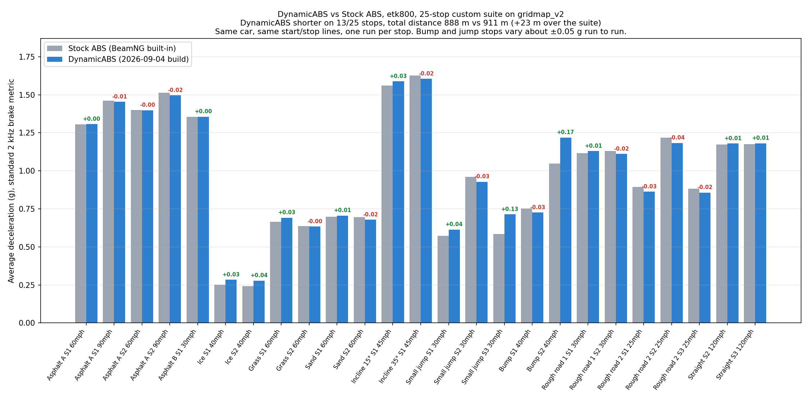

# BeamNG Dynamic ABS

An advanced, adaptive anti-lock braking controller for BeamNG.drive that actively responds to changing conditions. 

### What makes it Dynamic?
Unlike standard static ABS controllers, this system:
- **Fuses Telemetry Data:** Combines wheel speeds with IMU (accelerometer) data to calculate the true ground speed of the vehicle, even when all four wheels are locked or airborne.
- **Adapts to Surface Grip:** Continuously estimates the current surface friction (D-Estimator) and dynamically adjusts the target wheel slip. It knows the difference between asphalt and ice and changes its braking strategy accordingly.
- **Per-Wheel Optimization:** Each wheel runs its own independent PID control loop and grip estimator, meaning you can brake safely even with two wheels on tarmac and two wheels on wet grass.
- **Dynamic Vehicle Geometry:** Uses yaw rates and vehicle width/length to calculate the exact speed of *each individual wheel hub* during turns, rather than relying on a single center-of-mass speed.

## Results: DynamicABS vs stock ABS (2026-09-04)

25 recorded stops on gridmap_v2 with the etk800: asphalt at 30 to 120 mph, ice, grass, sand, 15° and 35° inclines,
a small jump, a bump, and two rough-road sections. Each stop uses the same start point and stop line for both
controllers, one run per stop, and the standard 2 kHz brake metric (average deceleration from the target speed down
to 1 m/s). Bump and jump stops vary about ±0.05 g from run to run; flat stops repeat within 0.005 g.

The build shown here adds the fused-speed re-anchoring described below on top of the released controller;
those changes are not yet in this repository.

| Stop | Stock ABS (g) | DynamicABS (g) | Δ |
|---|---|---|---|
| Asphalt A S1 60mph | 1.304 | 1.307 | +0.003 |
| Asphalt A S1 90mph | 1.461 | 1.454 | -0.006 |
| Asphalt A S2 60mph | 1.400 | 1.398 | -0.002 |
| Asphalt A S2 90mph | 1.512 | 1.497 | -0.015 |
| Asphalt B S1 30mph | 1.354 | 1.356 | +0.002 |
| Ice S1 40mph | 0.252 | 0.285 | +0.033 |
| Ice S2 40mph | 0.241 | 0.278 | +0.037 |
| Grass S1 60mph | 0.666 | 0.692 | +0.025 |
| Grass S2 60mph | 0.637 | 0.634 | -0.003 |
| Sand S1 60mph | 0.698 | 0.706 | +0.008 |
| Sand S2 60mph | 0.695 | 0.679 | -0.016 |
| Incline 15° S1 45mph | 1.560 | 1.588 | +0.028 |
| Incline 35° S1 45mph | 1.626 | 1.605 | -0.022 |
| Small jump S1 30mph | 0.572 | 0.614 | +0.041 |
| Small jump S2 30mph | 0.962 | 0.928 | -0.033 |
| Small jump S3 30mph | 0.585 | 0.715 | +0.130 |
| Bump S1 40mph | 0.752 | 0.727 | -0.025 |
| Bump S2 40mph | 1.047 | 1.219 | +0.172 |
| Rough road 1 S1 30mph | 1.115 | 1.130 | +0.014 |
| Rough road 1 S2 30mph | 1.130 | 1.111 | -0.018 |
| Rough road 2 S1 25mph | 0.894 | 0.863 | -0.031 |
| Rough road 2 S2 25mph | 1.219 | 1.183 | -0.036 |
| Rough road 2 S3 25mph | 0.881 | 0.857 | -0.024 |
| Straight S2 120mph | 1.173 | 1.179 | +0.007 |
| Straight S3 120mph | 1.176 | 1.181 | +0.005 |

