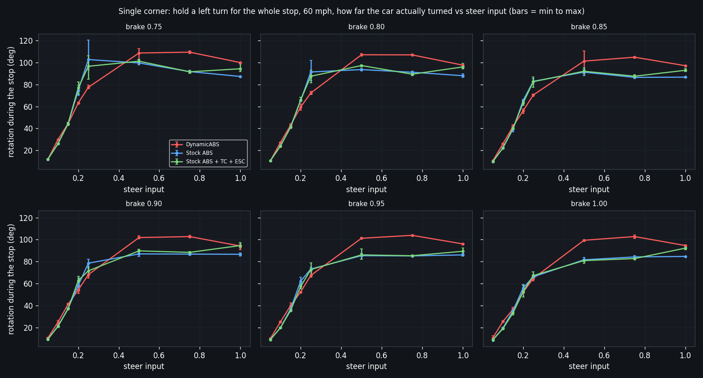

# BeamNG Dynamic ABS

An adaptive anti-lock braking controller for BeamNG.drive. It replaces the stock ABS logic on 21 vanilla vehicles with a per-wheel slip controller that estimates true ground speed from wheel speeds and the IMU, estimates the grip of each wheel while braking, and moves its slip target to where that grip peaks.

## What it does

- **Fused ground speed.** Wheel speeds are combined with the longitudinal accelerometer, so the controller still knows how fast the car is moving when all four wheels are locked, in the air, or landing from a bump.
- **Per-wheel grip estimate.** A torque-balance estimator (D estimator) tracks the friction each tyre is producing and shifts the slip target of that wheel toward the grip peak, on asphalt, in the wet, on ice.
- **Independent wheels.** Each wheel runs its own PID loop against its own target, so two wheels on tarmac and two on grass are regulated separately.
- **Hub speeds in corners.** Yaw rate and track width give the speed of each wheel hub, so the inner and outer wheels are compared against their own reference rather than the centre of the car.
- **Loose-surface regime.** When the decel level and the grip estimate say sand, gravel or dirt, the controller probes a locked wheel for under half a second and keeps it only if the car slows faster. It backs out as soon as asphalt is detected again.

## Install

1. Copy the repository folder into `%LOCALAPPDATA%\BeamNG.drive\<version>\mods\unpacked\Dynamic_ABS`, or zip it and drop the zip into `mods`.
2. In the vehicle configurator choose **Dynamic ABS** in the ABS slot. The part exists for bastion, bx, covet, etk800, etkc, etki, fullsize, hopper, lansdale, legran, midsize, pessima, pickup, rockbouncer, sbr, scintilla, sunburst, van, vivace and wendover.
3. Optional: add the **ABS Grip Gauges** app from the UI app menu to see per-wheel grip, fused speed and the regime counters while driving.

Development switches sit at the top of `lua/vehicle/controller/Dynamic_ABS.lua`: `ENABLE_IMU_LOG`, `USE_FIXED_SLIP_TARGET`, and the `d2` and `deep` tables. They ship at the values used for the measurements below.

## Measured against the stock ABS

Every number here comes from the BrakeTest mod's 2 kHz measurement, the same code path the BrakeTestGUI uses: stopping distance is the straight chord from the point where true speed crosses the target speed down to 1 m/s, and average g is the kinematic value v squared over 2d. Same etk800, same wheels, tyres and brakes for every controller, only the ABS part changes.

Full tables, charts and raw per-run CSVs: [results/RESULTS.md](results/RESULTS.md). Spreadsheet layout, one row per condition with the cars side by side: [results/RESULTS_SHEET.md](results/RESULTS_SHEET.md) and [results/results.xlsx](results/results.xlsx).

### Straight line, 10 runs per speed (2026-09-05)

| Speed | Dynamic ABS | Stock ABS | Difference |
|---|---|---|---|
| 60 mph | 1.196 g, 30.6 m | 1.170 g, 31.3 m | +0.025 g |
| 80 mph | 1.207 g, 54.0 m | 1.192 g, 54.7 m | +0.016 g |
| 120 mph | 1.204 g, 121.7 m | 1.200 g, 122.2 m | +0.005 g |
| 160 mph | 1.212 g, 215.1 m | 1.203 g, 216.8 m | +0.009 g |

Run to run spread is under 0.002 g except for one 60 mph outlier at 1.123 g, which is left in the data.

### Braking while cornering at 60 mph, 3 runs per cell (2026-09-05)

Brake and steer are applied together at 62 mph. Brake input 0.75 to 1.00 in 0.05 steps, steer input 0.05 to 1.00, two patterns: hold a left turn for the whole stop, or turn left and after one second turn right by a second random amount. 288 paired stops per controller.

| Metric, paired means | Dynamic ABS | Stock ABS | Dynamic ABS shorter in |
|---|---|---|---|
| Stopping distance, chord | 40.5 m | 41.8 m | 197 of 288 |
| Path length | 42.7 m | 43.7 m | 191 of 288 |
| Time to stop | 2.92 s | 2.97 s | 192 of 288 |

Dynamic ABS wins every paired stop from 0.10 to 0.25 steer, with a shorter path and a shorter time, so it is braking harder rather than turning more. At 0.50 and 0.75 steer the stock ABS stops 1 to 3 m shorter and Dynamic ABS carries 15 to 19 degrees more yaw. Adding traction and stability control to the stock car changed nothing measurable.

The second chart shows how far the car actually rotated during each stop against the same steer inputs. From 0.10 to 0.25 steer Dynamic ABS turns the same amount or slightly less while stopping shorter, so that gain is pure braking. At 0.50 and 0.75 steer it rotates 13 to 18 degrees more than Stock ABS, which is where the extra 1 to 3 m of distance goes.

### Surfaces and terrain, one run per stop (2026-09-04)

25 recorded stops on gridmap_v2: asphalt at 30 to 120 mph, ice, grass, sand, 15 and 35 degree inclines, a small jump, a bump and two rough road sections, same start point and stop line for both controllers. Bump and jump stops vary about 0.05 g from run to run, flat stops repeat within 0.005 g.

| Controller | Mean g, 25 stops | Total stopping distance | Stops shorter than stock | Worst single stop |
|---|---|---|---|---|
| Dynamic ABS | 1.0075 | 888.2 m | 13 of 25 | 0.036 g behind |
| Stock ABS | 0.9965 | 910.8 m | | |

| Stop | Speed | Stock ABS (g) | Dynamic ABS (g) | Difference (g) | Stock ABS (m) | Dynamic ABS (m) |
|---|---|---|---|---|---|---|
| Asphalt A S1 | 60 mph | 1.304 | 1.307 | +0.003 | 28.1 | 28.0 |
| Asphalt A S1 | 90 mph | 1.461 | 1.454 | -0.006 | 56.5 | 56.7 |
| Asphalt A S2 | 60 mph | 1.400 | 1.398 | -0.002 | 26.2 | 26.2 |
| Asphalt A S2 | 90 mph | 1.512 | 1.497 | -0.015 | 54.5 | 55.1 |
| Asphalt B S1 | 30 mph | 1.354 | 1.356 | +0.002 | 6.7 | 6.7 |
| Ice S1 | 40 mph | 0.252 | 0.285 | +0.033 | 64.5 | 57.1 |
| Ice S2 | 40 mph | 0.241 | 0.278 | +0.037 | 67.4 | 58.4 |
| Grass S1 | 60 mph | 0.666 | 0.692 | +0.025 | 55.0 | 52.9 |
| Grass S2 | 60 mph | 0.637 | 0.634 | -0.003 | 57.5 | 57.7 |
| Sand S1 | 60 mph | 0.698 | 0.706 | +0.008 | 52.4 | 51.8 |
| Sand S2 | 60 mph | 0.695 | 0.679 | -0.016 | 52.7 | 53.9 |
| Incline 15 deg S1 | 45 mph | 1.560 | 1.588 | +0.028 | 13.2 | 13.0 |
| Incline 35 deg S1 | 45 mph | 1.626 | 1.605 | -0.022 | 12.7 | 12.8 |
| Small jump S1 | 30 mph | 0.572 | 0.614 | +0.041 | 15.9 | 14.9 |
| Small jump S2 | 30 mph | 0.962 | 0.928 | -0.033 | 9.5 | 9.8 |
| Small jump S3 | 30 mph | 0.585 | 0.715 | +0.130 | 15.6 | 12.8 |
| Bump S1 | 40 mph | 0.752 | 0.727 | -0.025 | 21.6 | 22.4 |
| Bump S2 | 40 mph | 1.047 | 1.219 | +0.172 | 15.5 | 13.3 |
| Rough road 1 S1 | 30 mph | 1.115 | 1.130 | +0.014 | 8.2 | 8.1 |
| Rough road 1 S2 | 30 mph | 1.130 | 1.111 | -0.018 | 8.1 | 8.2 |
| Rough road 2 S1 | 25 mph | 0.894 | 0.863 | -0.031 | 7.1 | 7.3 |
| Rough road 2 S2 | 25 mph | 1.219 | 1.183 | -0.036 | 5.2 | 5.3 |
| Rough road 2 S3 | 25 mph | 0.881 | 0.857 | -0.024 | 7.2 | 7.4 |
| Straight S2 | 120 mph | 1.173 | 1.179 | +0.007 | 125.0 | 124.3 |
| Straight S3 | 120 mph | 1.176 | 1.181 | +0.005 | 124.7 | 124.1 |

The 2026-09-04 table was taken with the build of that day. The 2026-09-05 campaign and the controller in this repository add the banded loose-surface regime on top of it.

## Repository layout

- `lua/vehicle/controller/Dynamic_ABS.lua`: the controller.
- `lua/vehicle/extensions/abstelemv2.lua`: per-wheel brake torque hook, so thermal and race brake models keep working.
- `ui/modules/apps/ABSGripGauges/`: the in-game gauges app.
- `vehicles/<car>/Dynamic_ABS.jbeam`: the ABS part for each supported vehicle.
- `results/`: measurements, charts, spreadsheet and raw CSVs.

## Known limits

- Tuned and measured on the etk800. The other vehicles use the same gains with their own jbeam slip targets and have not been measured to the same depth.
- At 0.50 steer and above the car is sliding on saturated front tyres with either controller. Dynamic ABS lets the car rotate a little more there, which costs 1 to 3 m at 60 mph.
- On ice the stock ABS and Dynamic ABS are within a few hundredths of a g of each other. The loose-surface regime never engages there by design.
