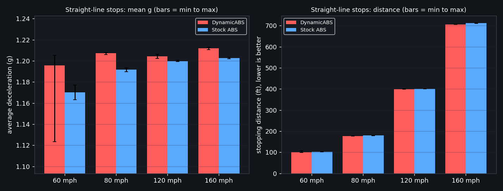
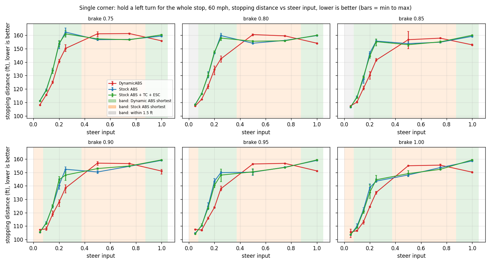
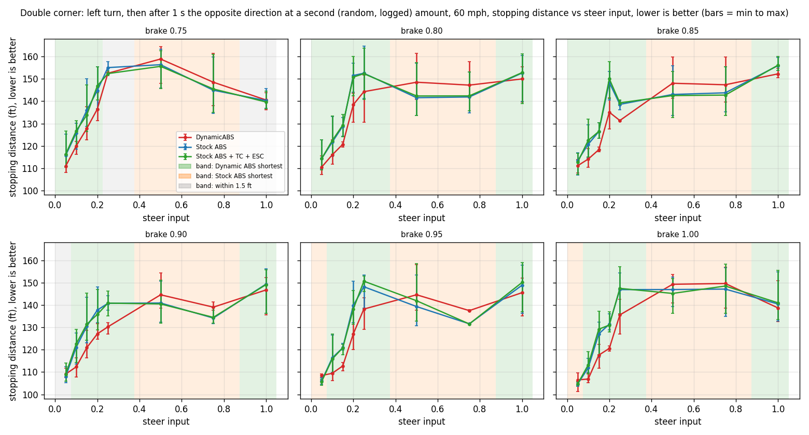

# DynamicABS vs stock ABS: measured results

Test date 2026-09-05. All numbers come from the BrakeTest mod's own 2 kHz measurement (the same code the BrakeTestGUI uses): distance is the straight chord from the point where true speed crosses the target down to 1 m/s, average g is the kinematic v²/2d value, both sampled in the physics step.

Cars: etk800 with the same wheels, tyres and brakes, differing only in the DSE ABS part (`DynamicABS1` = this controller, `StockABS1` = BeamNG's stock ABS, `StockABSTCESC1` = stock ABS with traction and stability control, cornering only). BeamNG.tech 0.37.6 headless on smallgrid with the physics speed factor raised. The 60 and 120 mph straight stops match the real-time BeamNG.drive 0.39.4 runs of the previous day within 0.005 g. DynamicABS build: banded loose-surface regime (`ENABLE_DEEP = true, LEVEL_GATE = true`), code key `ba2f3327`.

**Scoreboard.** Straight line: DynamicABS stops shorter at all four speeds (60, 80, 120, 160 mph), by 0.005 to 0.025 g. Cornering at 60 mph: shorter chord, shorter path and less time to stop over 288 paired stops, with the gain concentrated at 0.10 to 0.25 steer. At 0.50 and 0.75 steer the stock ABS stops shorter. Traction plus stability control on the stock car changes nothing measurable in this test.

## Straight-line stops (smallgrid)

Source: `campaign_straight_20260905_1541.csv`. Per cell: n runs, average deceleration in g (mean, min to max, sd) and stopping distance (mean m / ft).

| Speed | Controller | n | Mean g | Min g | Max g | sd g | Mean dist (m) | Mean dist (ft) | Δ vs stock (g) |
|---|---|---|---|---|---|---|---|---|---|
| 60 mph | DynamicABS | 10 | **1.196** | 1.123 | 1.205 | 0.0254 | 30.64 | 100.5 | +0.025 |
| 60 mph | Stock ABS | 10 | **1.170** | 1.163 | 1.177 | 0.0042 | 31.29 | 102.7 |  |
| 80 mph | DynamicABS | 10 | **1.207** | 1.206 | 1.208 | 0.0006 | 53.95 | 177.0 | +0.016 |
| 80 mph | Stock ABS | 10 | **1.192** | 1.190 | 1.193 | 0.0012 | 54.66 | 179.3 |  |
| 120 mph | DynamicABS | 10 | **1.204** | 1.202 | 1.206 | 0.0010 | 121.73 | 399.4 | +0.005 |
| 120 mph | Stock ABS | 10 | **1.200** | 1.199 | 1.201 | 0.0005 | 122.22 | 401.0 |  |
| 160 mph | DynamicABS | 10 | **1.212** | 1.211 | 1.213 | 0.0008 | 215.11 | 705.7 | +0.009 |
| 160 mph | Stock ABS | 10 | **1.203** | 1.202 | 1.203 | 0.0004 | 216.75 | 711.1 |  |

## Braking while cornering (smallgrid, 60 mph)

Source: `campaign_corner_20260905_1959.csv`. Brake and steer are applied together at 62 mph, measurement runs from 60 mph to 1 m/s. Steer values are BeamNG steering input (1.00 = full lock). Each cell: mean (min to max) of the runs. Runs rejected (no measurement / damage / timeout): 0.

### Head-to-head, DynamicABS vs stock ABS (paired by steer, brake, mode and run)

Chord is the reported stopping distance. Path length and time to stop answer whether DynamicABS is shorter because it brakes harder or merely because it turns more: a controller that traded braking for steering would show a longer path and a longer time.

| Metric (mean over 288 paired stops) | DynamicABS | Stock ABS | Δ | DynamicABS better in | p (paired t) |
|---|---|---|---|---|---|
| Chord distance (m) | 40.52 | 41.79 | -1.26 | 197 / 288 | 2.4e-21 |
| Path length (m) | 42.65 | 43.67 | -1.01 | 191 / 288 | 4.7e-08 |
| Time to stop (s) | 2.92 | 2.97 | -0.05 | 192 / 288 | 4.2e-04 |
| Accumulated yaw (deg) | 61.7 | 56.7 | +5.0 |  | 9.7e-10 |

| Steer | n | Chord (m) Dyn / Stock | Path (m) Dyn / Stock | Time (s) Dyn / Stock | Yaw (deg) Dyn / Stock | Chord wins |
|---|---|---|---|---|---|---|
| 0.05 | 36 | 33.0 / 33.1 | 33.2 / 33.3 | 2.36 / 2.40 | 17 / 18 | 17 / 36 |
| 0.10 | 36 | 34.0 / 35.6 | 34.4 / 35.9 | 2.44 / 2.54 | 33 / 31 | 36 / 36 |
| 0.15 | 36 | 36.4 / 38.9 | 37.1 / 39.6 | 2.56 / 2.71 | 43 / 41 | 36 / 36 |
| 0.20 | 36 | 39.8 / 43.8 | 41.2 / 45.9 | 2.80 / 3.09 | 60 / 68 | 36 / 36 |
| 0.25 | 36 | 42.6 / 45.9 | 45.3 / 49.0 | 3.11 / 3.29 | 78 / 79 | 36 / 36 |
| 0.50 | 36 | 46.8 / 45.3 | 51.5 / 48.3 | 3.48 / 3.23 | 95 / 76 | 1 / 36 |
| 0.75 | 36 | 46.1 / 45.0 | 49.9 / 47.7 | 3.29 / 3.18 | 82 / 67 | 0 / 36 |
| 1.00 | 36 | 45.4 / 46.8 | 48.8 / 49.7 | 3.27 / 3.31 | 84 / 74 | 35 / 36 |

Stops shorter than stock by more than 5 cm: 197 of 288, longer: 89. DynamicABS is ahead from 0.10 to 0.25 steer on chord, path and time. At 0.50 and 0.75 steer stock stops shorter and DynamicABS carries more yaw.

### Single corner: hold a left turn for the whole stop

### single: average deceleration (g)

**DynamicABS**

| Brake \ Steer | 0.05 | 0.10 | 0.15 | 0.20 | 0.25 | 0.50 | 0.75 | 1.00 |
|---|---|---|---|---|---|---|---|---|
| 0.75 | 1.111 (1.109 to 1.113) | 1.039 (1.035 to 1.044) | 0.960 (0.954 to 0.968) | 0.854 (0.845 to 0.861) | 0.800 (0.785 to 0.813) | 0.746 (0.739 to 0.756) | 0.745 (0.743 to 0.747) | 0.771 (0.769 to 0.771) |
| 0.80 | 1.120 (1.116 to 1.122) | 1.069 (1.067 to 1.071) | 0.984 (0.974 to 0.999) | 0.893 (0.876 to 0.920) | 0.844 (0.831 to 0.859) | 0.748 (0.746 to 0.753) | 0.753 (0.751 to 0.755) | 0.780 (0.778 to 0.781) |
| 0.85 | 1.119 (1.119 to 1.120) | 1.089 (1.083 to 1.095) | 0.998 (0.983 to 1.006) | 0.921 (0.904 to 0.943) | 0.849 (0.841 to 0.854) | 0.767 (0.737 to 0.801) | 0.761 (0.759 to 0.762) | 0.786 (0.783 to 0.788) |
| 0.90 | 1.119 (1.117 to 1.119) | 1.113 (1.097 to 1.125) | 1.010 (0.991 to 1.024) | 0.940 (0.927 to 0.964) | 0.868 (0.854 to 0.891) | 0.766 (0.760 to 0.773) | 0.767 (0.765 to 0.770) | 0.795 (0.789 to 0.808) |
| 0.95 | 1.116 (1.115 to 1.117) | 1.122 (1.118 to 1.129) | 1.038 (1.030 to 1.042) | 0.970 (0.966 to 0.975) | 0.872 (0.860 to 0.881) | 0.769 (0.767 to 0.770) | 0.766 (0.765 to 0.767) | 0.795 (0.794 to 0.796) |
| 1.00 | 1.139 (1.116 to 1.185) | 1.127 (1.123 to 1.131) | 1.062 (1.050 to 1.078) | 0.965 (0.961 to 0.970) | 0.889 (0.884 to 0.898) | 0.775 (0.773 to 0.776) | 0.773 (0.769 to 0.779) | 0.800 (0.798 to 0.801) |

**Stock ABS**

| Brake \ Steer | 0.05 | 0.10 | 0.15 | 0.20 | 0.25 | 0.50 | 0.75 | 1.00 |
|---|---|---|---|---|---|---|---|---|
| 0.75 | 1.080 (1.079 to 1.082) | 1.006 (1.000 to 1.015) | 0.897 (0.892 to 0.901) | 0.784 (0.773 to 0.800) | 0.740 (0.726 to 0.753) | 0.766 (0.761 to 0.770) | 0.766 (0.764 to 0.766) | 0.753 (0.752 to 0.755) |
| 0.80 | 1.108 (1.104 to 1.110) | 1.031 (1.029 to 1.034) | 0.925 (0.903 to 0.937) | 0.819 (0.816 to 0.822) | 0.752 (0.744 to 0.759) | 0.780 (0.779 to 0.780) | 0.769 (0.768 to 0.770) | 0.752 (0.751 to 0.753) |
| 0.85 | 1.128 (1.123 to 1.133) | 1.052 (1.046 to 1.059) | 0.942 (0.925 to 0.967) | 0.819 (0.812 to 0.824) | 0.772 (0.768 to 0.777) | 0.781 (0.774 to 0.784) | 0.776 (0.774 to 0.779) | 0.754 (0.753 to 0.755) |
| 0.90 | 1.140 (1.137 to 1.143) | 1.068 (1.059 to 1.075) | 0.963 (0.959 to 0.970) | 0.857 (0.828 to 0.873) | 0.789 (0.779 to 0.804) | 0.799 (0.794 to 0.805) | 0.777 (0.777 to 0.778) | 0.756 (0.755 to 0.757) |
| 0.95 | 1.147 (1.142 to 1.153) | 1.090 (1.088 to 1.093) | 0.963 (0.943 to 0.983) | 0.838 (0.825 to 0.848) | 0.802 (0.796 to 0.807) | 0.800 (0.789 to 0.813) | 0.781 (0.778 to 0.783) | 0.756 (0.754 to 0.758) |
| 1.00 | 1.159 (1.155 to 1.165) | 1.093 (1.076 to 1.102) | 0.984 (0.971 to 0.992) | 0.867 (0.850 to 0.879) | 0.837 (0.828 to 0.842) | 0.811 (0.803 to 0.818) | 0.782 (0.779 to 0.784) | 0.758 (0.757 to 0.758) |

**Stock ABS + TC + ESC**

| Brake \ Steer | 0.05 | 0.10 | 0.15 | 0.20 | 0.25 | 0.50 | 0.75 | 1.00 |
|---|---|---|---|---|---|---|---|---|
| 0.75 | 1.082 (1.079 to 1.085) | 1.010 (1.008 to 1.013) | 0.897 (0.886 to 0.914) | 0.781 (0.769 to 0.793) | 0.746 (0.734 to 0.757) | 0.764 (0.762 to 0.766) | 0.767 (0.764 to 0.769) | 0.749 (0.747 to 0.750) |
| 0.80 | 1.110 (1.103 to 1.118) | 1.032 (1.029 to 1.036) | 0.923 (0.910 to 0.934) | 0.814 (0.810 to 0.818) | 0.761 (0.750 to 0.769) | 0.772 (0.770 to 0.776) | 0.770 (0.769 to 0.773) | 0.751 (0.750 to 0.752) |
| 0.85 | 1.125 (1.121 to 1.128) | 1.056 (1.052 to 1.063) | 0.931 (0.928 to 0.933) | 0.831 (0.820 to 0.841) | 0.774 (0.763 to 0.790) | 0.785 (0.782 to 0.790) | 0.774 (0.770 to 0.778) | 0.751 (0.750 to 0.752) |
| 0.90 | 1.137 (1.135 to 1.141) | 1.072 (1.065 to 1.080) | 0.961 (0.953 to 0.973) | 0.831 (0.818 to 0.855) | 0.812 (0.799 to 0.833) | 0.786 (0.784 to 0.788) | 0.776 (0.775 to 0.777) | 0.754 (0.753 to 0.755) |
| 0.95 | 1.152 (1.148 to 1.154) | 1.087 (1.076 to 1.093) | 0.973 (0.964 to 0.981) | 0.856 (0.843 to 0.867) | 0.812 (0.788 to 0.840) | 0.799 (0.787 to 0.811) | 0.782 (0.779 to 0.783) | 0.754 (0.752 to 0.756) |
| 1.00 | 1.157 (1.154 to 1.158) | 1.102 (1.101 to 1.105) | 0.993 (0.985 to 1.006) | 0.889 (0.854 to 0.919) | 0.831 (0.812 to 0.843) | 0.806 (0.794 to 0.815) | 0.789 (0.787 to 0.790) | 0.754 (0.752 to 0.755) |

### single: stopping distance (ft)

**DynamicABS**

| Brake \ Steer | 0.05 | 0.10 | 0.15 | 0.20 | 0.25 | 0.50 | 0.75 | 1.00 |
|---|---|---|---|---|---|---|---|---|
| 0.75 | 108.2 (107.9 to 108.4) | 115.7 (115.1 to 116.1) | 125.1 (124.1 to 125.9) | 140.7 (139.5 to 142.1) | 150.2 (147.8 to 153.1) | 161.1 (158.8 to 162.6) | 161.3 (160.9 to 161.7) | 155.9 (155.8 to 156.2) |
| 0.80 | 107.3 (107.1 to 107.6) | 112.3 (112.2 to 112.6) | 122.1 (120.3 to 123.4) | 134.6 (130.6 to 137.1) | 142.4 (139.9 to 144.7) | 160.5 (159.6 to 161.1) | 159.6 (159.1 to 160.0) | 154.1 (153.7 to 154.4) |
| 0.85 | 107.3 (107.3 to 107.3) | 110.3 (109.8 to 111.0) | 120.4 (119.4 to 122.3) | 130.5 (127.4 to 132.9) | 141.5 (140.7 to 142.8) | 156.7 (150.0 to 162.9) | 157.9 (157.6 to 158.2) | 152.9 (152.5 to 153.4) |
| 0.90 | 107.4 (107.3 to 107.5) | 107.9 (106.8 to 109.5) | 118.9 (117.3 to 121.3) | 127.9 (124.6 to 129.6) | 138.4 (134.8 to 140.7) | 156.9 (155.4 to 158.1) | 156.6 (156.0 to 157.0) | 151.0 (148.7 to 152.3) |
| 0.95 | 107.6 (107.6 to 107.7) | 107.0 (106.4 to 107.5) | 115.8 (115.3 to 116.6) | 123.9 (123.2 to 124.3) | 137.9 (136.4 to 139.8) | 156.3 (156.1 to 156.6) | 156.8 (156.6 to 156.9) | 151.2 (150.9 to 151.3) |
| 1.00 | 105.6 (101.4 to 107.7) | 106.6 (106.2 to 107.0) | 113.1 (111.4 to 114.4) | 124.5 (123.8 to 125.0) | 135.1 (133.8 to 135.8) | 155.0 (154.8 to 155.4) | 155.5 (154.2 to 156.3) | 150.2 (150.0 to 150.5) |

**Stock ABS**

| Brake \ Steer | 0.05 | 0.10 | 0.15 | 0.20 | 0.25 | 0.50 | 0.75 | 1.00 |
|---|---|---|---|---|---|---|---|---|
| 0.75 | 111.2 (111.0 to 111.4) | 119.4 (118.3 to 120.1) | 134.0 (133.4 to 134.6) | 153.2 (150.1 to 155.5) | 162.4 (159.5 to 165.6) | 156.8 (156.0 to 157.9) | 156.9 (156.8 to 157.3) | 159.5 (159.2 to 159.7) |
| 0.80 | 108.5 (108.2 to 108.8) | 116.5 (116.2 to 116.8) | 129.9 (128.2 to 133.0) | 146.8 (146.2 to 147.2) | 159.8 (158.2 to 161.4) | 154.1 (154.0 to 154.3) | 156.2 (156.0 to 156.4) | 159.8 (159.5 to 160.0) |
| 0.85 | 106.5 (106.1 to 106.9) | 114.2 (113.5 to 114.8) | 127.5 (124.2 to 129.9) | 146.8 (145.8 to 148.0) | 155.7 (154.7 to 156.5) | 153.8 (153.1 to 155.1) | 154.9 (154.2 to 155.2) | 159.3 (159.1 to 159.5) |
| 0.90 | 105.4 (105.1 to 105.7) | 112.5 (111.8 to 113.4) | 124.8 (123.9 to 125.3) | 140.3 (137.6 to 145.2) | 152.4 (149.4 to 154.2) | 150.3 (149.1 to 151.3) | 154.6 (154.5 to 154.7) | 159.0 (158.7 to 159.2) |
| 0.95 | 104.7 (104.2 to 105.2) | 110.2 (109.9 to 110.4) | 124.8 (122.2 to 127.5) | 143.4 (141.7 to 145.6) | 149.9 (148.8 to 151.0) | 150.2 (147.7 to 152.2) | 153.9 (153.4 to 154.4) | 159.0 (158.6 to 159.2) |
| 1.00 | 103.6 (103.1 to 104.0) | 110.0 (109.0 to 111.7) | 122.1 (121.1 to 123.7) | 138.6 (136.7 to 141.4) | 143.5 (142.6 to 145.1) | 148.1 (146.8 to 149.6) | 153.6 (153.2 to 154.2) | 158.6 (158.5 to 158.6) |

**Stock ABS + TC + ESC**

| Brake \ Steer | 0.05 | 0.10 | 0.15 | 0.20 | 0.25 | 0.50 | 0.75 | 1.00 |
|---|---|---|---|---|---|---|---|---|
| 0.75 | 111.1 (110.7 to 111.3) | 118.9 (118.6 to 119.2) | 134.0 (131.5 to 135.6) | 153.9 (151.5 to 156.2) | 161.1 (158.7 to 163.6) | 157.4 (156.9 to 157.7) | 156.7 (156.2 to 157.3) | 160.4 (160.1 to 160.8) |
| 0.80 | 108.3 (107.4 to 108.9) | 116.4 (116.0 to 116.7) | 130.2 (128.7 to 132.0) | 147.5 (146.8 to 148.3) | 158.0 (156.2 to 160.2) | 155.6 (154.7 to 156.0) | 155.9 (155.5 to 156.2) | 160.0 (159.7 to 160.3) |
| 0.85 | 106.8 (106.5 to 107.2) | 113.8 (113.0 to 114.2) | 129.0 (128.7 to 129.4) | 144.6 (142.9 to 146.4) | 155.3 (152.0 to 157.4) | 153.0 (152.0 to 153.6) | 155.1 (154.3 to 155.9) | 160.0 (159.8 to 160.2) |
| 0.90 | 105.6 (105.3 to 105.8) | 112.1 (111.3 to 112.8) | 125.1 (123.5 to 126.0) | 144.6 (140.6 to 146.8) | 148.0 (144.2 to 150.4) | 152.9 (152.4 to 153.3) | 154.8 (154.6 to 155.1) | 159.4 (159.2 to 159.5) |
| 0.95 | 104.3 (104.1 to 104.6) | 110.6 (110.0 to 111.7) | 123.4 (122.5 to 124.6) | 140.3 (138.6 to 142.5) | 148.0 (143.1 to 152.4) | 150.5 (148.2 to 152.6) | 153.7 (153.4 to 154.1) | 159.3 (158.9 to 159.7) |
| 1.00 | 103.9 (103.8 to 104.1) | 109.0 (108.7 to 109.1) | 121.0 (119.4 to 121.9) | 135.3 (130.8 to 140.7) | 144.5 (142.6 to 147.9) | 149.1 (147.5 to 151.2) | 152.3 (152.1 to 152.6) | 159.4 (159.1 to 159.7) |

### single: accumulated yaw over the stop (deg)

**DynamicABS**

| Brake \ Steer | 0.05 | 0.10 | 0.15 | 0.20 | 0.25 | 0.50 | 0.75 | 1.00 |
|---|---|---|---|---|---|---|---|---|
| 0.75 | 12 (12 to 12) | 30 (30 to 30) | 44 (43 to 45) | 63 (63 to 64) | 77 (76 to 79) | 109 (103 to 113) | 109 (108 to 110) | 100 (100 to 100) |
| 0.80 | 10 (10 to 11) | 27 (27 to 27) | 43 (42 to 44) | 60 (57 to 62) | 72 (71 to 74) | 107 (106 to 108) | 107 (106 to 108) | 98 (97 to 98) |
| 0.85 | 10 (10 to 11) | 26 (26 to 27) | 42 (41 to 43) | 56 (54 to 58) | 70 (69 to 71) | 101 (91 to 110) | 105 (104 to 105) | 97 (97 to 97) |
| 0.90 | 10 (10 to 11) | 25 (23 to 27) | 41 (40 to 42) | 54 (51 to 56) | 68 (65 to 71) | 102 (101 to 103) | 103 (102 to 104) | 94 (91 to 96) |
| 0.95 | 10 (10 to 10) | 25 (24 to 26) | 40 (38 to 42) | 52 (52 to 53) | 67 (66 to 71) | 101 (100 to 102) | 104 (103 to 104) | 96 (95 to 97) |
| 1.00 | 10 (9 to 12) | 25 (25 to 26) | 37 (35 to 38) | 52 (52 to 52) | 65 (63 to 66) | 99 (99 to 100) | 103 (101 to 104) | 95 (94 to 95) |

**Stock ABS**

| Brake \ Steer | 0.05 | 0.10 | 0.15 | 0.20 | 0.25 | 0.50 | 0.75 | 1.00 |
|---|---|---|---|---|---|---|---|---|
| 0.75 | 12 (12 to 12) | 26 (26 to 26) | 44 (44 to 45) | 75 (70 to 79) | 103 (94 to 121) | 100 (98 to 102) | 92 (91 to 92) | 87 (87 to 88) |
| 0.80 | 11 (10 to 11) | 24 (24 to 24) | 41 (40 to 43) | 65 (65 to 66) | 91 (84 to 102) | 94 (93 to 95) | 91 (90 to 92) | 88 (86 to 90) |
| 0.85 | 10 (10 to 10) | 22 (22 to 23) | 39 (37 to 42) | 66 (65 to 66) | 83 (80 to 85) | 91 (88 to 93) | 86 (86 to 87) | 87 (86 to 87) |
| 0.90 | 9 (9 to 9) | 21 (21 to 22) | 37 (37 to 38) | 58 (55 to 65) | 79 (74 to 82) | 87 (85 to 89) | 87 (86 to 88) | 87 (85 to 88) |
| 0.95 | 9 (9 to 10) | 20 (19 to 20) | 37 (35 to 39) | 62 (60 to 66) | 73 (72 to 75) | 85 (82 to 87) | 85 (85 to 85) | 86 (85 to 87) |
| 1.00 | 9 (8 to 9) | 19 (19 to 20) | 35 (34 to 36) | 56 (54 to 59) | 66 (66 to 67) | 82 (80 to 84) | 84 (83 to 85) | 85 (84 to 85) |

**Stock ABS + TC + ESC**

| Brake \ Steer | 0.05 | 0.10 | 0.15 | 0.20 | 0.25 | 0.50 | 0.75 | 1.00 |
|---|---|---|---|---|---|---|---|---|
| 0.75 | 12 (12 to 12) | 26 (26 to 26) | 44 (43 to 46) | 77 (71 to 82) | 97 (85 to 106) | 101 (100 to 103) | 92 (90 to 93) | 94 (92 to 98) |
| 0.80 | 11 (10 to 11) | 24 (24 to 24) | 41 (40 to 43) | 66 (64 to 68) | 88 (81 to 93) | 97 (97 to 98) | 89 (88 to 91) | 96 (94 to 99) |
| 0.85 | 10 (10 to 10) | 22 (22 to 22) | 40 (40 to 41) | 63 (61 to 65) | 83 (78 to 87) | 92 (90 to 95) | 88 (86 to 89) | 93 (92 to 95) |
| 0.90 | 9 (9 to 10) | 21 (20 to 22) | 37 (36 to 37) | 63 (57 to 66) | 72 (67 to 75) | 90 (88 to 91) | 88 (87 to 89) | 95 (92 to 98) |
| 0.95 | 9 (9 to 9) | 20 (19 to 20) | 36 (35 to 36) | 57 (55 to 60) | 73 (66 to 79) | 86 (82 to 92) | 85 (85 to 86) | 89 (85 to 92) |
| 1.00 | 9 (9 to 9) | 19 (19 to 19) | 33 (32 to 35) | 53 (48 to 58) | 67 (65 to 71) | 81 (79 to 82) | 83 (82 to 83) | 92 (91 to 94) |

### single: mean understeer (deg, wheel angle minus kinematic angle)

**DynamicABS**

| Brake \ Steer | 0.05 | 0.10 | 0.15 | 0.20 | 0.25 | 0.50 | 0.75 | 1.00 |
|---|---|---|---|---|---|---|---|---|
| 0.75 | 0.6 (0.6 to 0.6) | 0.7 (0.7 to 0.8) | 1.3 (1.3 to 1.3) | 1.9 (1.9 to 2.0) | 3.0 (2.9 to 3.0) | 9.4 (9.3 to 9.5) | 17.7 (17.6 to 17.8) | 27.7 (27.6 to 27.8) |
| 0.80 | 0.6 (0.6 to 0.6) | 0.9 (0.9 to 0.9) | 1.4 (1.4 to 1.4) | 2.1 (2.0 to 2.1) | 3.0 (3.0 to 3.0) | 9.5 (9.4 to 9.6) | 17.9 (17.9 to 17.9) | 27.8 (27.7 to 27.9) |
| 0.85 | 0.6 (0.6 to 0.7) | 0.9 (0.9 to 1.0) | 1.4 (1.4 to 1.5) | 2.1 (2.1 to 2.2) | 3.1 (3.0 to 3.1) | 9.7 (9.5 to 9.9) | 17.9 (17.9 to 17.9) | 27.7 (27.7 to 27.8) |
| 0.90 | 0.6 (0.6 to 0.6) | 1.0 (0.9 to 1.1) | 1.4 (1.4 to 1.4) | 2.2 (2.1 to 2.3) | 3.1 (3.0 to 3.2) | 9.6 (9.6 to 9.7) | 18.0 (17.9 to 18.0) | 27.9 (27.8 to 28.0) |
| 0.95 | 0.6 (0.6 to 0.7) | 0.9 (0.9 to 0.9) | 1.4 (1.3 to 1.5) | 2.2 (2.1 to 2.2) | 3.1 (3.0 to 3.2) | 9.5 (9.5 to 9.6) | 17.9 (17.8 to 18.0) | 27.7 (27.6 to 27.8) |
| 1.00 | 0.6 (0.4 to 0.7) | 0.8 (0.8 to 0.9) | 1.5 (1.4 to 1.6) | 2.2 (2.2 to 2.2) | 3.1 (3.1 to 3.2) | 9.6 (9.5 to 9.6) | 17.9 (17.8 to 17.9) | 27.7 (27.6 to 27.7) |

**Stock ABS**

| Brake \ Steer | 0.05 | 0.10 | 0.15 | 0.20 | 0.25 | 0.50 | 0.75 | 1.00 |
|---|---|---|---|---|---|---|---|---|
| 0.75 | 0.5 (0.5 to 0.6) | 1.1 (1.1 to 1.1) | 1.6 (1.6 to 1.7) | 1.9 (1.9 to 2.0) | 2.6 (2.4 to 2.8) | 10.0 (9.8 to 10.2) | 19.1 (19.1 to 19.1) | 29.4 (29.3 to 29.4) |
| 0.80 | 0.7 (0.6 to 0.7) | 1.2 (1.2 to 1.2) | 1.8 (1.8 to 1.9) | 2.3 (2.3 to 2.3) | 2.9 (2.6 to 3.1) | 10.3 (10.2 to 10.3) | 19.1 (19.0 to 19.3) | 29.4 (29.3 to 29.5) |
| 0.85 | 0.7 (0.7 to 0.8) | 1.3 (1.3 to 1.4) | 1.8 (1.7 to 1.9) | 2.2 (2.2 to 2.3) | 3.1 (3.0 to 3.2) | 10.4 (10.2 to 10.5) | 19.4 (19.3 to 19.5) | 29.4 (29.4 to 29.5) |
| 0.90 | 0.7 (0.7 to 0.8) | 1.4 (1.3 to 1.4) | 1.9 (1.9 to 2.0) | 2.5 (2.2 to 2.6) | 3.2 (3.1 to 3.3) | 10.5 (10.4 to 10.6) | 19.4 (19.3 to 19.4) | 29.3 (29.2 to 29.4) |
| 0.95 | 0.7 (0.7 to 0.7) | 1.4 (1.4 to 1.5) | 2.0 (1.9 to 2.1) | 2.3 (2.2 to 2.4) | 3.4 (3.3 to 3.5) | 10.5 (10.4 to 10.6) | 19.3 (19.3 to 19.4) | 29.4 (29.3 to 29.6) |
| 1.00 | 0.7 (0.7 to 0.8) | 1.4 (1.4 to 1.4) | 2.0 (1.9 to 2.0) | 2.5 (2.4 to 2.6) | 3.5 (3.5 to 3.5) | 10.6 (10.6 to 10.7) | 19.4 (19.4 to 19.5) | 29.5 (29.5 to 29.5) |

**Stock ABS + TC + ESC**

| Brake \ Steer | 0.05 | 0.10 | 0.15 | 0.20 | 0.25 | 0.50 | 0.75 | 1.00 |
|---|---|---|---|---|---|---|---|---|
| 0.75 | 0.6 (0.6 to 0.6) | 1.1 (1.0 to 1.1) | 1.6 (1.6 to 1.7) | 1.9 (1.7 to 2.1) | 2.7 (2.5 to 3.0) | 9.9 (9.8 to 10.0) | 19.2 (19.1 to 19.2) | 28.9 (28.3 to 29.3) |
| 0.80 | 0.7 (0.7 to 0.7) | 1.2 (1.2 to 1.3) | 1.8 (1.8 to 1.8) | 2.3 (2.2 to 2.4) | 3.0 (2.8 to 3.1) | 10.1 (10.0 to 10.2) | 19.3 (19.2 to 19.4) | 28.6 (28.1 to 28.9) |
| 0.85 | 0.7 (0.7 to 0.8) | 1.3 (1.3 to 1.4) | 1.9 (1.8 to 1.9) | 2.4 (2.3 to 2.4) | 3.1 (3.0 to 3.3) | 10.3 (10.2 to 10.4) | 19.3 (19.2 to 19.4) | 28.9 (28.7 to 29.1) |
| 0.90 | 0.7 (0.7 to 0.8) | 1.4 (1.4 to 1.4) | 2.0 (2.0 to 2.1) | 2.4 (2.2 to 2.5) | 3.4 (3.3 to 3.6) | 10.5 (10.4 to 10.6) | 19.2 (19.2 to 19.2) | 28.6 (28.1 to 28.8) |
| 0.95 | 0.7 (0.7 to 0.8) | 1.5 (1.4 to 1.5) | 2.0 (2.0 to 2.0) | 2.5 (2.5 to 2.6) | 3.4 (3.2 to 3.6) | 10.6 (10.4 to 10.7) | 19.4 (19.3 to 19.4) | 29.2 (28.8 to 29.7) |
| 1.00 | 0.7 (0.7 to 0.7) | 1.4 (1.4 to 1.5) | 2.1 (2.0 to 2.2) | 2.6 (2.4 to 2.9) | 3.5 (3.5 to 3.5) | 10.8 (10.7 to 10.9) | 19.4 (19.3 to 19.5) | 28.8 (28.7 to 29.0) |

**single: all cells pooled**

| Controller | n | Mean g | Mean dist (ft) | Mean yaw (deg) | Mean understeer (deg) | Mean ACS |
|---|---|---|---|---|---|---|
| DynamicABS | 144 | 0.914 | 134.5 | 64 | 7.9 | 94.5 |
| Stock ABS | 144 | 0.883 | 139.1 | 60 | 8.5 | 93.3 |
| Stock ABS + TC + ESC | 144 | 0.884 | 139.0 | 61 | 8.5 | 93.3 |

### Double corner: left turn, then after 1 s the opposite direction at a second (random, logged) amount

Second-corner amounts by cell (rep 1 / 2 / 3), identical for every car:

| Brake \ Steer | 0.05 | 0.10 | 0.15 | 0.20 | 0.25 | 0.50 | 0.75 | 1.00 |
|---|---|---|---|---|---|---|---|---|
| 0.75 | 0.05 / 1.00 / 0.05 | 0.15 / 0.50 / 0.50 | 0.05 / 1.00 / 0.10 | 0.20 / 0.05 / 0.50 | 0.50 / 0.75 / 0.50 | 0.75 / 0.20 / 1.00 | 0.05 / 1.00 / 0.15 | 0.10 / 0.05 / 0.20 |
| 0.80 | 0.20 / 0.10 / 1.00 | 1.00 / 0.15 / 0.10 | 0.25 / 0.05 / 0.20 | 0.25 / 1.00 / 0.50 | 1.00 / 0.75 / 0.15 | 0.05 / 0.75 / 0.10 | 0.10 / 0.15 / 0.50 | 1.00 / 0.75 / 0.15 |
| 0.85 | 0.75 / 0.15 / 0.50 | 0.25 / 1.00 / 0.15 | 0.15 / 0.25 / 0.05 | 0.25 / 1.00 / 0.50 | 0.15 / 0.15 / 0.15 | 0.10 / 0.20 / 0.75 | 0.75 / 0.10 / 0.20 | 0.50 / 1.00 / 0.50 |
| 0.90 | 0.10 / 0.15 / 0.50 | 0.50 / 0.15 / 1.00 | 0.20 / 1.00 / 0.20 | 0.50 / 0.05 / 0.05 | 0.25 / 0.05 / 0.25 | 0.50 / 0.20 / 0.10 | 0.05 / 0.20 / 0.05 | 0.75 / 0.15 / 0.75 |
| 0.95 | 0.25 / 0.05 / 0.20 | 0.15 / 0.05 / 1.00 | 0.15 / 0.05 / 0.20 | 0.75 / 0.20 / 0.25 | 0.75 / 0.25 / 0.75 | 0.15 / 0.10 / 1.00 | 0.05 / 0.05 / 0.05 | 0.15 / 1.00 / 0.50 |
| 1.00 | 0.15 / 0.25 / 0.10 | 0.50 / 0.10 / 0.05 | 0.75 / 0.50 / 0.05 | 0.10 / 0.25 / 0.20 | 0.50 / 0.20 / 1.00 | 0.25 / 0.75 / 0.50 | 1.00 / 0.50 / 0.20 | 0.10 / 0.10 / 0.75 |

### double: average deceleration (g)

**DynamicABS**

| Brake \ Steer | 0.05 | 0.10 | 0.15 | 0.20 | 0.25 | 0.50 | 0.75 | 1.00 |
|---|---|---|---|---|---|---|---|---|
| 0.75 | 1.084 (1.034 to 1.112) | 1.002 (0.985 to 1.033) | 0.943 (0.874 to 0.980) | 0.882 (0.835 to 0.914) | 0.788 (0.786 to 0.789) | 0.758 (0.731 to 0.812) | 0.812 (0.744 to 0.870) | 0.855 (0.835 to 0.883) |
| 0.80 | 1.088 (1.040 to 1.120) | 1.038 (0.978 to 1.074) | 0.995 (0.987 to 1.005) | 0.869 (0.836 to 0.920) | 0.837 (0.792 to 0.920) | 0.812 (0.744 to 0.854) | 0.818 (0.762 to 0.850) | 0.803 (0.773 to 0.861) |
| 0.85 | 1.082 (1.056 to 1.113) | 1.054 (1.010 to 1.087) | 1.016 (1.006 to 1.023) | 0.891 (0.849 to 0.942) | 0.914 (0.913 to 0.916) | 0.814 (0.752 to 0.851) | 0.818 (0.751 to 0.860) | 0.789 (0.777 to 0.798) |
| 0.90 | 1.102 (1.074 to 1.116) | 1.071 (1.032 to 1.115) | 0.996 (0.934 to 1.032) | 0.946 (0.912 to 0.964) | 0.923 (0.910 to 0.947) | 0.833 (0.779 to 0.867) | 0.864 (0.849 to 0.872) | 0.821 (0.788 to 0.886) |
| 0.95 | 1.108 (1.099 to 1.117) | 1.099 (1.037 to 1.131) | 1.066 (1.052 to 1.086) | 0.949 (0.872 to 1.001) | 0.871 (0.839 to 0.931) | 0.834 (0.760 to 0.873) | 0.874 (0.870 to 0.875) | 0.828 (0.790 to 0.889) |
| 1.00 | 1.130 (1.097 to 1.187) | 1.124 (1.097 to 1.141) | 1.023 (0.982 to 1.076) | 0.996 (0.987 to 1.006) | 0.888 (0.843 to 0.946) | 0.806 (0.782 to 0.852) | 0.805 (0.766 to 0.867) | 0.869 (0.796 to 0.906) |

**Stock ABS**

| Brake \ Steer | 0.05 | 0.10 | 0.15 | 0.20 | 0.25 | 0.50 | 0.75 | 1.00 |
|---|---|---|---|---|---|---|---|---|
| 0.75 | 1.041 (0.959 to 1.083) | 0.957 (0.923 to 1.014) | 0.889 (0.801 to 0.933) | 0.832 (0.774 to 0.880) | 0.775 (0.761 to 0.783) | 0.770 (0.736 to 0.823) | 0.833 (0.752 to 0.892) | 0.857 (0.825 to 0.878) |
| 0.80 | 1.054 (0.979 to 1.095) | 0.992 (0.902 to 1.042) | 0.933 (0.905 to 0.966) | 0.794 (0.765 to 0.834) | 0.791 (0.729 to 0.850) | 0.853 (0.764 to 0.898) | 0.849 (0.784 to 0.892) | 0.790 (0.748 to 0.859) |
| 0.85 | 1.061 (1.028 to 1.123) | 0.998 (0.928 to 1.048) | 0.951 (0.922 to 0.973) | 0.811 (0.784 to 0.854) | 0.867 (0.857 to 0.882) | 0.844 (0.770 to 0.900) | 0.839 (0.773 to 0.889) | 0.770 (0.753 to 0.781) |
| 0.90 | 1.113 (1.068 to 1.142) | 0.994 (0.942 to 1.057) | 0.925 (0.837 to 0.977) | 0.875 (0.810 to 0.909) | 0.854 (0.834 to 0.873) | 0.855 (0.797 to 0.907) | 0.896 (0.865 to 0.912) | 0.807 (0.769 to 0.882) |
| 0.95 | 1.133 (1.118 to 1.149) | 1.037 (0.949 to 1.093) | 0.994 (0.977 to 1.003) | 0.862 (0.798 to 0.909) | 0.812 (0.783 to 0.867) | 0.867 (0.783 to 0.920) | 0.913 (0.911 to 0.914) | 0.810 (0.761 to 0.881) |
| 1.00 | 1.148 (1.138 to 1.159) | 1.074 (1.034 to 1.094) | 0.949 (0.908 to 1.030) | 0.915 (0.883 to 0.932) | 0.820 (0.779 to 0.883) | 0.819 (0.788 to 0.863) | 0.820 (0.767 to 0.891) | 0.860 (0.776 to 0.904) |

**Stock ABS + TC + ESC**

| Brake \ Steer | 0.05 | 0.10 | 0.15 | 0.20 | 0.25 | 0.50 | 0.75 | 1.00 |
|---|---|---|---|---|---|---|---|---|
| 0.75 | 1.038 (0.948 to 1.088) | 0.950 (0.916 to 1.006) | 0.902 (0.815 to 0.950) | 0.820 (0.773 to 0.855) | 0.788 (0.782 to 0.793) | 0.774 (0.739 to 0.825) | 0.830 (0.746 to 0.889) | 0.861 (0.832 to 0.880) |
| 0.80 | 1.054 (0.979 to 1.100) | 0.986 (0.900 to 1.035) | 0.930 (0.896 to 0.968) | 0.798 (0.751 to 0.843) | 0.792 (0.734 to 0.854) | 0.848 (0.764 to 0.899) | 0.846 (0.785 to 0.885) | 0.790 (0.745 to 0.864) |
| 0.85 | 1.068 (1.029 to 1.122) | 0.984 (0.911 to 1.045) | 0.951 (0.922 to 0.973) | 0.803 (0.762 to 0.850) | 0.863 (0.854 to 0.869) | 0.846 (0.784 to 0.905) | 0.845 (0.773 to 0.899) | 0.770 (0.751 to 0.782) |
| 0.90 | 1.103 (1.054 to 1.134) | 0.982 (0.930 to 1.050) | 0.919 (0.827 to 0.967) | 0.888 (0.818 to 0.932) | 0.854 (0.821 to 0.889) | 0.858 (0.795 to 0.910) | 0.894 (0.864 to 0.910) | 0.809 (0.771 to 0.882) |
| 0.95 | 1.136 (1.124 to 1.155) | 1.042 (0.946 to 1.101) | 0.994 (0.981 to 1.020) | 0.871 (0.820 to 0.913) | 0.798 (0.785 to 0.823) | 0.852 (0.757 to 0.904) | 0.913 (0.912 to 0.915) | 0.804 (0.755 to 0.876) |
| 1.00 | 1.147 (1.136 to 1.158) | 1.063 (1.008 to 1.100) | 0.934 (0.876 to 1.020) | 0.918 (0.877 to 0.939) | 0.818 (0.765 to 0.882) | 0.829 (0.791 to 0.882) | 0.812 (0.758 to 0.881) | 0.856 (0.772 to 0.899) |

### double: stopping distance (ft)

**DynamicABS**

| Brake \ Steer | 0.05 | 0.10 | 0.15 | 0.20 | 0.25 | 0.50 | 0.75 | 1.00 |
|---|---|---|---|---|---|---|---|---|
| 0.75 | 110.9 (108.0 to 116.2) | 120.0 (116.3 to 122.0) | 127.8 (122.6 to 137.5) | 136.5 (131.4 to 143.8) | 152.5 (152.2 to 152.9) | 158.9 (148.0 to 164.4) | 148.5 (138.1 to 161.4) | 140.5 (136.1 to 143.9) |
| 0.80 | 110.5 (107.3 to 115.6) | 116.0 (111.9 to 122.8) | 120.7 (119.5 to 121.7) | 138.4 (130.5 to 143.6) | 144.3 (130.5 to 151.7) | 148.5 (140.7 to 161.4) | 147.2 (141.4 to 157.7) | 150.0 (139.6 to 155.3) |
| 0.85 | 111.1 (107.9 to 113.8) | 114.1 (110.5 to 118.9) | 118.3 (117.4 to 119.4) | 135.1 (127.5 to 141.4) | 131.4 (131.2 to 131.5) | 148.0 (141.2 to 159.7) | 147.4 (139.7 to 159.9) | 152.3 (150.6 to 154.7) |
| 0.90 | 109.1 (107.7 to 111.8) | 112.3 (107.7 to 116.5) | 120.9 (116.4 to 128.7) | 127.1 (124.6 to 131.7) | 130.2 (126.9 to 132.0) | 144.6 (138.6 to 154.3) | 139.1 (137.8 to 141.5) | 146.8 (135.6 to 152.4) |
| 0.95 | 108.5 (107.5 to 109.3) | 109.5 (106.2 to 115.8) | 112.8 (110.6 to 114.3) | 127.1 (120.0 to 137.8) | 138.2 (129.1 to 143.3) | 144.6 (137.6 to 158.0) | 137.5 (137.2 to 138.0) | 145.5 (135.1 to 152.0) |
| 1.00 | 106.5 (101.2 to 109.5) | 106.9 (105.3 to 109.5) | 117.6 (111.7 to 122.3) | 120.6 (119.4 to 121.7) | 135.6 (127.0 to 142.5) | 149.3 (140.9 to 153.7) | 149.6 (138.6 to 156.8) | 138.7 (132.6 to 150.9) |

**Stock ABS**

| Brake \ Steer | 0.05 | 0.10 | 0.15 | 0.20 | 0.25 | 0.50 | 0.75 | 1.00 |
|---|---|---|---|---|---|---|---|---|
| 0.75 | 115.8 (110.9 to 125.3) | 125.8 (118.4 to 130.2) | 135.9 (128.8 to 150.1) | 144.8 (136.6 to 155.3) | 155.1 (153.4 to 157.8) | 156.3 (145.9 to 163.4) | 144.9 (134.6 to 159.8) | 140.3 (136.8 to 145.6) |
| 0.80 | 114.3 (109.8 to 122.8) | 121.7 (115.3 to 133.2) | 128.8 (124.4 to 132.7) | 151.5 (144.0 to 157.1) | 152.5 (141.4 to 164.8) | 141.6 (133.7 to 157.1) | 141.9 (134.7 to 153.1) | 152.6 (139.8 to 160.5) |
| 0.85 | 113.4 (107.0 to 116.9) | 120.7 (114.6 to 129.5) | 126.4 (123.5 to 130.3) | 148.4 (140.7 to 153.3) | 138.6 (136.3 to 140.2) | 143.0 (133.5 to 155.9) | 143.8 (135.2 to 155.4) | 156.0 (153.8 to 159.6) |
| 0.90 | 108.0 (105.2 to 112.5) | 121.1 (113.7 to 127.6) | 130.5 (123.0 to 143.5) | 137.7 (132.2 to 148.2) | 140.8 (137.6 to 144.1) | 140.9 (132.4 to 150.7) | 134.2 (131.7 to 138.9) | 149.4 (136.3 to 156.2) |
| 0.95 | 106.1 (104.5 to 107.5) | 116.3 (110.0 to 126.6) | 120.9 (119.8 to 123.0) | 139.8 (132.2 to 150.6) | 148.2 (138.6 to 153.4) | 139.3 (130.6 to 153.5) | 131.6 (131.5 to 131.9) | 148.9 (136.3 to 158.0) |
| 1.00 | 104.6 (103.7 to 105.5) | 111.9 (109.8 to 116.2) | 127.1 (116.7 to 132.3) | 131.4 (128.9 to 136.0) | 146.9 (136.1 to 154.3) | 146.9 (139.3 to 152.5) | 147.1 (134.8 to 156.7) | 140.5 (132.9 to 154.9) |

**Stock ABS + TC + ESC**

| Brake \ Steer | 0.05 | 0.10 | 0.15 | 0.20 | 0.25 | 0.50 | 0.75 | 1.00 |
|---|---|---|---|---|---|---|---|---|
| 0.75 | 116.2 (110.4 to 126.7) | 126.7 (119.5 to 131.2) | 133.8 (126.4 to 147.4) | 146.8 (140.5 to 155.5) | 152.4 (151.5 to 153.6) | 155.6 (145.6 to 162.6) | 145.5 (135.1 to 161.0) | 139.6 (136.6 to 144.4) |
| 0.80 | 114.3 (109.2 to 122.7) | 122.3 (116.1 to 133.5) | 129.3 (124.1 to 134.1) | 150.8 (142.5 to 160.0) | 152.3 (140.7 to 163.7) | 142.3 (133.7 to 157.2) | 142.4 (135.7 to 153.0) | 152.8 (139.1 to 161.3) |
| 0.85 | 112.7 (107.1 to 116.8) | 122.5 (115.0 to 131.9) | 126.4 (123.4 to 130.3) | 150.0 (141.3 to 157.6) | 139.3 (138.3 to 140.7) | 142.5 (132.8 to 153.3) | 142.7 (133.6 to 155.4) | 156.1 (153.7 to 160.0) |
| 0.90 | 109.0 (105.9 to 114.0) | 122.6 (114.4 to 129.2) | 131.4 (124.2 to 145.3) | 135.8 (128.9 to 147.0) | 140.9 (135.2 to 146.3) | 140.5 (132.0 to 151.1) | 134.5 (131.9 to 139.0) | 149.2 (136.2 to 155.8) |
| 0.95 | 105.8 (104.0 to 106.9) | 115.8 (109.2 to 127.0) | 120.9 (117.8 to 122.4) | 138.2 (131.5 to 146.5) | 150.7 (146.0 to 153.1) | 141.9 (132.9 to 158.6) | 131.5 (131.3 to 131.7) | 150.1 (137.1 to 159.0) |
| 1.00 | 104.7 (103.8 to 105.8) | 113.2 (109.2 to 119.2) | 129.2 (117.8 to 137.1) | 131.0 (127.9 to 137.0) | 147.5 (136.1 to 157.1) | 145.2 (136.2 to 151.8) | 148.5 (136.4 to 158.4) | 141.0 (133.6 to 155.6) |

### double: accumulated yaw over the stop (deg)

**DynamicABS**

| Brake \ Steer | 0.05 | 0.10 | 0.15 | 0.20 | 0.25 | 0.50 | 0.75 | 1.00 |
|---|---|---|---|---|---|---|---|---|
| 0.75 | 23 (9 to 52) | 51 (34 to 61) | 49 (27 to 85) | 63 (32 to 98) | 139 (138 to 141) | 99 (66 to 123) | 60 (29 to 100) | 41 (26 to 58) |
| 0.80 | 28 (11 to 52) | 41 (24 to 69) | 40 (26 to 49) | 85 (61 to 100) | 100 (48 to 134) | 72 (38 to 134) | 64 (39 to 104) | 81 (47 to 101) |
| 0.85 | 35 (16 to 49) | 43 (27 to 65) | 37 (25 to 48) | 81 (58 to 98) | 47 (47 to 48) | 81 (42 to 139) | 69 (39 to 111) | 94 (92 to 96) |
| 0.90 | 22 (12 to 39) | 46 (25 to 63) | 54 (40 to 81) | 48 (31 to 83) | 52 (37 to 63) | 83 (41 to 149) | 40 (30 to 57) | 81 (44 to 101) |
| 0.95 | 17 (7 to 24) | 34 (16 to 64) | 30 (22 to 38) | 66 (46 to 97) | 96 (59 to 115) | 69 (41 to 116) | 30 (29 to 31) | 78 (43 to 96) |
| 1.00 | 18 (13 to 25) | 27 (16 to 46) | 54 (22 to 76) | 44 (34 to 53) | 86 (54 to 107) | 121 (69 to 148) | 89 (56 to 109) | 57 (34 to 103) |

**Stock ABS**

| Brake \ Steer | 0.05 | 0.10 | 0.15 | 0.20 | 0.25 | 0.50 | 0.75 | 1.00 |
|---|---|---|---|---|---|---|---|---|
| 0.75 | 27 (12 to 58) | 52 (30 to 64) | 47 (26 to 82) | 78 (32 to 140) | 107 (71 to 144) | 82 (60 to 94) | 52 (26 to 85) | 38 (26 to 54) |
| 0.80 | 31 (15 to 54) | 39 (22 to 68) | 42 (25 to 56) | 96 (72 to 123) | 76 (50 to 108) | 50 (28 to 89) | 53 (32 to 86) | 69 (41 to 85) |
| 0.85 | 37 (18 to 48) | 42 (26 to 62) | 37 (24 to 52) | 88 (67 to 108) | 47 (46 to 48) | 57 (32 to 87) | 54 (31 to 83) | 84 (83 to 84) |
| 0.90 | 22 (12 to 39) | 45 (24 to 60) | 53 (39 to 78) | 53 (31 to 97) | 57 (34 to 73) | 57 (32 to 86) | 32 (24 to 48) | 67 (37 to 82) |
| 0.95 | 18 (8 to 25) | 32 (15 to 58) | 31 (22 to 37) | 66 (49 to 91) | 86 (61 to 101) | 51 (31 to 82) | 24 (24 to 24) | 65 (37 to 81) |
| 1.00 | 16 (11 to 22) | 26 (14 to 44) | 51 (20 to 66) | 47 (34 to 59) | 82 (53 to 102) | 74 (56 to 86) | 68 (43 to 81) | 47 (29 to 82) |

**Stock ABS + TC + ESC**

| Brake \ Steer | 0.05 | 0.10 | 0.15 | 0.20 | 0.25 | 0.50 | 0.75 | 1.00 |
|---|---|---|---|---|---|---|---|---|
| 0.75 | 28 (11 to 62) | 53 (31 to 67) | 50 (26 to 92) | 69 (35 to 110) | 81 (74 to 85) | 82 (58 to 97) | 54 (26 to 93) | 37 (26 to 54) |
| 0.80 | 33 (15 to 58) | 41 (22 to 70) | 43 (24 to 59) | 92 (70 to 103) | 78 (49 to 117) | 51 (27 to 90) | 52 (32 to 84) | 74 (40 to 97) |
| 0.85 | 35 (17 to 47) | 47 (27 to 72) | 38 (24 to 52) | 92 (67 to 110) | 48 (47 to 49) | 57 (32 to 85) | 55 (31 to 85) | 87 (81 to 96) |
| 0.90 | 24 (12 to 44) | 50 (25 to 69) | 56 (39 to 88) | 50 (29 to 91) | 57 (33 to 73) | 55 (32 to 84) | 33 (24 to 49) | 67 (36 to 82) |
| 0.95 | 17 (8 to 24) | 36 (14 to 71) | 30 (21 to 38) | 65 (48 to 87) | 91 (74 to 103) | 54 (32 to 91) | 25 (24 to 25) | 69 (38 to 85) |
| 1.00 | 16 (11 to 22) | 27 (15 to 49) | 53 (22 to 74) | 45 (33 to 59) | 84 (53 to 102) | 72 (52 to 84) | 71 (46 to 89) | 47 (29 to 82) |

### double: mean understeer (deg, wheel angle minus kinematic angle)

**DynamicABS**

| Brake \ Steer | 0.05 | 0.10 | 0.15 | 0.20 | 0.25 | 0.50 | 0.75 | 1.00 |
|---|---|---|---|---|---|---|---|---|
| 0.75 | 6.2 (0.7 to 17.1) | 4.3 (1.2 to 6.0) | 6.8 (0.9 to 18.4) | 3.0 (1.2 to 5.8) | 7.0 (5.1 to 10.9) | 13.6 (4.6 to 22.0) | 12.9 (7.2 to 24.2) | 10.5 (10.3 to 10.7) |
| 0.80 | 6.8 (1.2 to 17.0) | 6.6 (1.1 to 17.3) | 1.8 (1.0 to 2.5) | 9.1 (2.5 to 18.6) | 10.8 (2.4 to 18.8) | 7.4 (4.2 to 13.6) | 8.5 (7.3 to 10.7) | 18.7 (10.7 to 26.3) |
| 0.85 | 6.2 (1.7 to 10.8) | 7.1 (1.6 to 17.1) | 1.7 (1.0 to 2.4) | 9.0 (2.6 to 18.4) | 2.4 (2.3 to 2.4) | 7.5 (4.5 to 13.3) | 10.5 (7.5 to 16.4) | 17.9 (13.5 to 26.3) |
| 0.90 | 3.0 (1.3 to 6.1) | 8.2 (1.7 to 16.8) | 7.3 (2.1 to 17.6) | 2.9 (1.3 to 5.9) | 2.6 (1.7 to 3.2) | 5.3 (4.6 to 6.5) | 7.4 (7.2 to 7.7) | 16.4 (11.1 to 19.1) |
| 0.95 | 1.9 (0.9 to 2.7) | 6.5 (1.0 to 16.6) | 1.9 (1.2 to 2.3) | 5.5 (2.4 to 11.3) | 8.5 (3.1 to 11.3) | 10.2 (4.6 to 21.0) | 7.3 (7.3 to 7.4) | 16.9 (11.2 to 26.0) |
| 1.00 | 1.8 (1.2 to 2.5) | 2.8 (1.0 to 6.0) | 5.9 (1.3 to 10.6) | 2.3 (1.9 to 2.8) | 8.9 (2.6 to 18.3) | 7.9 (5.1 to 12.3) | 13.9 (7.9 to 23.6) | 13.7 (11.2 to 18.7) |

**Stock ABS**

| Brake \ Steer | 0.05 | 0.10 | 0.15 | 0.20 | 0.25 | 0.50 | 0.75 | 1.00 |
|---|---|---|---|---|---|---|---|---|
| 0.75 | 6.6 (0.6 to 18.7) | 4.9 (1.5 to 6.7) | 7.7 (1.0 to 20.6) | 2.7 (1.3 to 4.6) | 9.4 (4.7 to 16.5) | 14.9 (5.1 to 23.6) | 13.8 (7.5 to 25.9) | 11.0 (10.7 to 11.5) |
| 0.80 | 7.3 (1.1 to 18.7) | 7.4 (1.3 to 19.3) | 2.0 (1.2 to 2.6) | 9.7 (2.6 to 21.0) | 13.3 (2.6 to 21.1) | 8.7 (4.7 to 16.3) | 9.5 (8.1 to 12.3) | 20.3 (11.3 to 28.3) |
| 0.85 | 6.6 (1.6 to 11.8) | 7.9 (1.9 to 19.2) | 2.0 (1.2 to 2.8) | 9.7 (2.7 to 20.2) | 2.7 (2.7 to 2.8) | 9.1 (5.3 to 16.4) | 11.9 (8.2 to 18.7) | 19.5 (15.1 to 28.3) |
| 0.90 | 3.2 (1.3 to 6.6) | 9.3 (1.9 to 19.2) | 8.4 (2.5 to 20.2) | 3.2 (1.5 to 6.7) | 2.8 (2.0 to 3.4) | 7.0 (5.3 to 10.0) | 8.1 (7.8 to 8.6) | 18.1 (11.8 to 21.2) |
| 0.95 | 2.0 (0.9 to 2.7) | 7.4 (1.1 to 19.2) | 2.0 (1.2 to 2.6) | 6.3 (2.7 to 13.2) | 10.2 (3.6 to 13.8) | 11.4 (5.4 to 23.1) | 7.9 (7.9 to 8.0) | 18.6 (11.9 to 28.3) |
| 1.00 | 2.0 (1.3 to 2.9) | 3.3 (1.1 to 7.1) | 7.2 (1.4 to 13.0) | 2.6 (2.0 to 3.1) | 10.3 (3.1 to 21.1) | 10.9 (6.3 to 16.1) | 15.9 (9.1 to 25.9) | 14.9 (11.6 to 21.2) |

**Stock ABS + TC + ESC**

| Brake \ Steer | 0.05 | 0.10 | 0.15 | 0.20 | 0.25 | 0.50 | 0.75 | 1.00 |
|---|---|---|---|---|---|---|---|---|
| 0.75 | 6.7 (0.6 to 19.0) | 4.9 (1.5 to 6.7) | 7.2 (1.0 to 19.2) | 3.4 (1.3 to 6.6) | 11.5 (9.0 to 16.2) | 14.9 (5.2 to 23.3) | 13.7 (7.6 to 25.6) | 10.8 (10.7 to 11.0) |
| 0.80 | 7.1 (1.1 to 18.3) | 7.5 (1.3 to 19.5) | 2.0 (1.2 to 2.5) | 9.9 (2.6 to 20.7) | 13.1 (2.6 to 20.1) | 8.7 (4.7 to 16.3) | 9.6 (8.0 to 12.6) | 19.8 (11.3 to 26.9) |
| 0.85 | 6.6 (1.6 to 11.8) | 7.7 (1.8 to 18.7) | 2.0 (1.2 to 2.8) | 9.8 (2.8 to 20.7) | 2.7 (2.6 to 2.7) | 9.0 (5.2 to 16.1) | 11.8 (8.2 to 18.5) | 19.1 (15.1 to 26.8) |
| 0.90 | 3.1 (1.2 to 6.4) | 9.1 (1.9 to 18.6) | 8.2 (2.6 to 19.4) | 3.3 (1.5 to 7.0) | 2.8 (1.9 to 3.4) | 7.1 (5.3 to 10.2) | 8.1 (7.9 to 8.6) | 18.2 (11.8 to 21.4) |
| 0.95 | 2.0 (0.9 to 2.8) | 6.9 (1.1 to 17.6) | 2.1 (1.3 to 2.7) | 6.4 (2.8 to 13.3) | 9.9 (3.0 to 13.5) | 11.4 (5.3 to 23.3) | 7.9 (7.9 to 8.0) | 18.3 (11.7 to 28.0) |
| 1.00 | 2.0 (1.3 to 2.9) | 3.2 (1.0 to 6.9) | 7.1 (1.3 to 12.7) | 2.8 (2.1 to 3.2) | 10.3 (3.1 to 20.6) | 11.0 (6.5 to 16.4) | 15.6 (8.8 to 25.3) | 14.9 (11.7 to 21.3) |

**double: all cells pooled**

| Controller | n | Mean g | Mean dist (ft) | Mean yaw (deg) | Mean understeer (deg) | Mean ACS |
|---|---|---|---|---|---|---|
| DynamicABS | 144 | 0.929 | 131.4 | 60 | 7.6 | 95.3 |
| Stock ABS | 144 | 0.902 | 135.1 | 53 | 8.6 | 94.1 |
| Stock ABS + TC + ESC | 144 | 0.901 | 135.3 | 54 | 8.6 | 94.0 |

