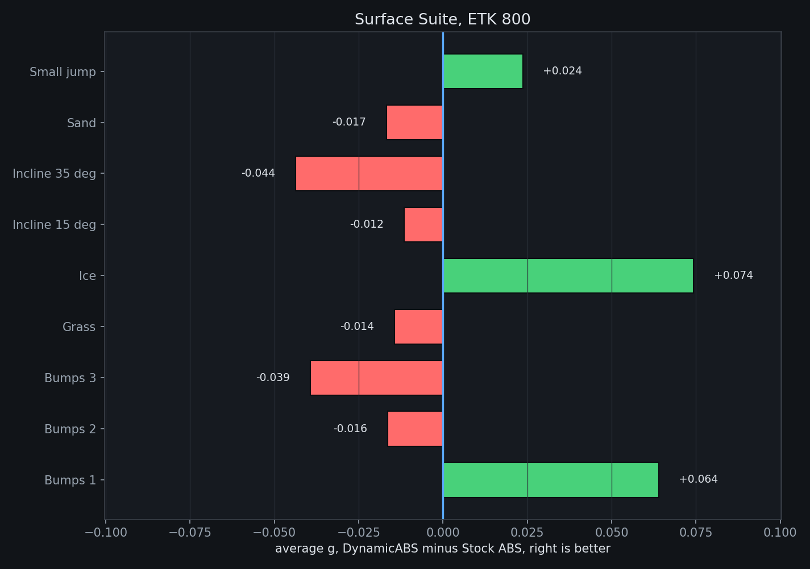
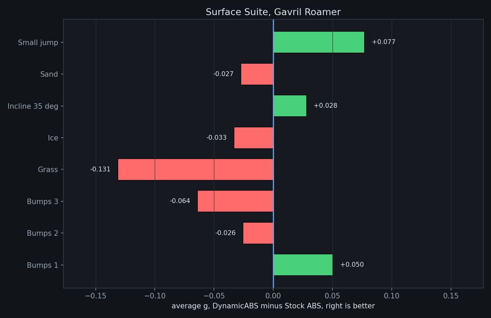
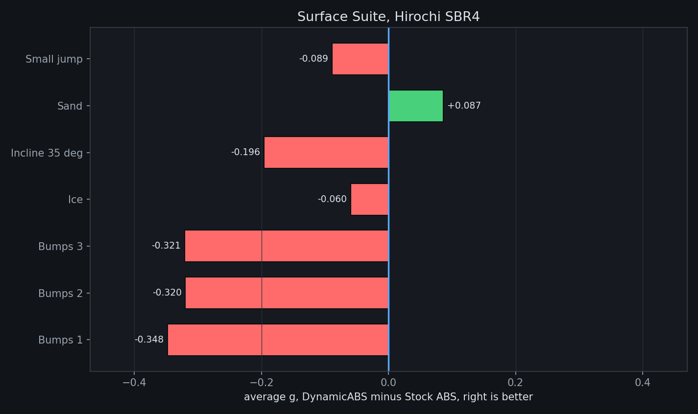
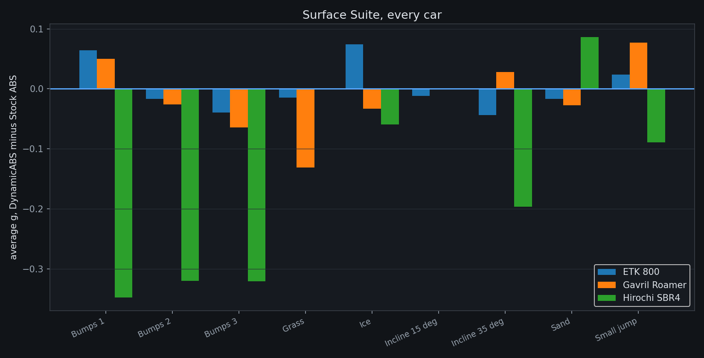

# Surface Suite

DynamicABS against Stock ABS on the recorded gridmap areas: ice, grass, sand, inclines, a small jump and three bump sections. Average g is the standard metric, higher is better. Every cell is three runs per controller.

## ETK 800

| Area | DynamicABS g | Stock ABS g | Difference |
|---|---|---|---|
| Bumps 1 | 0.9184 | 0.8544 | +0.0639 |
| Bumps 2 | 1.1075 | 1.1240 | -0.0165 |
| Bumps 3 | 0.9431 | 0.9825 | -0.0394 |
| Grass | 0.6445 | 0.6588 | -0.0143 |
| Ice | 0.3174 | 0.2431 | +0.0743 |
| Incline 15 deg | 1.5643 | 1.5759 | -0.0116 |
| Incline 35 deg | 1.5803 | 1.6241 | -0.0438 |
| Sand | 0.6841 | 0.7008 | -0.0167 |
| Small jump | 0.7018 | 0.6781 | +0.0237 |

Wins on 3 of 9 areas.

## Gavril Roamer

| Area | DynamicABS g | Stock ABS g | Difference |
|---|---|---|---|
| Bumps 1 | 0.5953 | 0.5450 | +0.0503 |
| Bumps 2 | 0.8582 | 0.8839 | -0.0257 |
| Bumps 3 | 0.7628 | 0.8270 | -0.0642 |
| Grass | 0.5177 | 0.6490 | -0.1313 |
| Ice | 0.1883 | 0.2215 | -0.0333 |
| Incline 35 deg | 0.8364 | 0.8084 | +0.0280 |
| Sand | 0.7042 | 0.7316 | -0.0274 |
| Small jump | 0.7678 | 0.6908 | +0.0771 |

Wins on 3 of 8 areas.

## Hirochi SBR4

| Area | DynamicABS g | Stock ABS g | Difference |
|---|---|---|---|
| Bumps 1 | 0.7510 | 1.0990 | -0.3480 |
| Bumps 2 | 1.0737 | 1.3935 | -0.3198 |
| Bumps 3 | 0.8096 | 1.1303 | -0.3207 |
| Ice | 0.2635 | 0.3231 | -0.0596 |
| Incline 35 deg | 1.3813 | 1.5776 | -0.1963 |
| Sand | 0.7880 | 0.7015 | +0.0865 |
| Small jump | 0.6509 | 0.7397 | -0.0889 |

Wins on 1 of 7 areas.

## Every car

